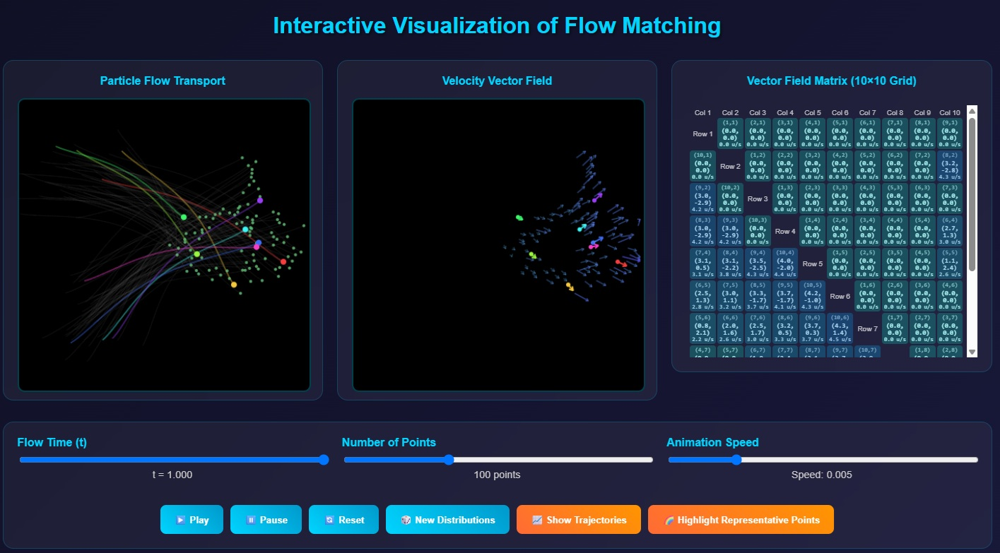

# Interactive Visualization of Flow Matching

## What This Is
This interactive visualization demonstrates how particles flow from an initial distribution to a target distribution under a time-dependent vector field.

## How to Use It
1. **Access the simulation**: [Open Interactive Demo](https://nbahador.github.io/Interactive_Visualization_of_Flow_Matching/)
2. **Controls**:
   - Play/Pause/Reset buttons control the animation
   - Adjust time manually with the slider
   - Toggle trajectories and highlighted points
   - Generate new random distributions

## What You'll See
- **Left Panel**: Particle movement from start to target positions
- **Middle Panel**: Velocity vectors showing the flow direction
- **Right Panel**: Numerical vector field values on a 10×10 grid

## Visual Elements
- 💚 Green dots: Current particle positions
- 🧡 Colored dots: Highlighted representative particles
- 🔵 Blue dots: Initial positions (fading)
- 🔴 Red dots: Target positions (appearing)

Explore how the vector field evolves to transport particles between distributions!
